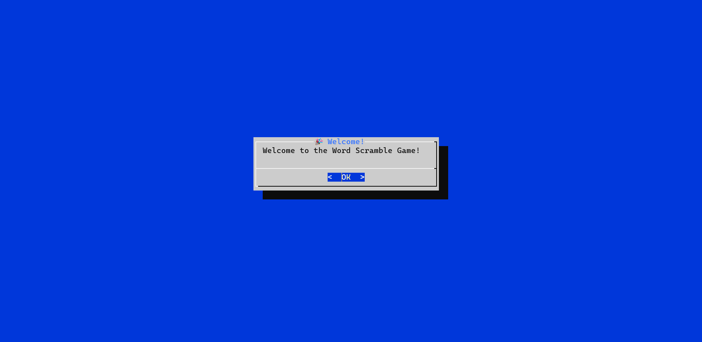
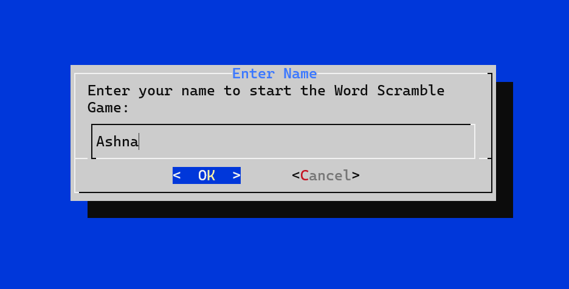
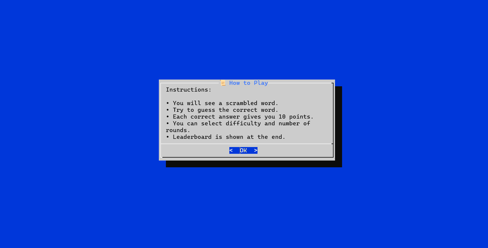
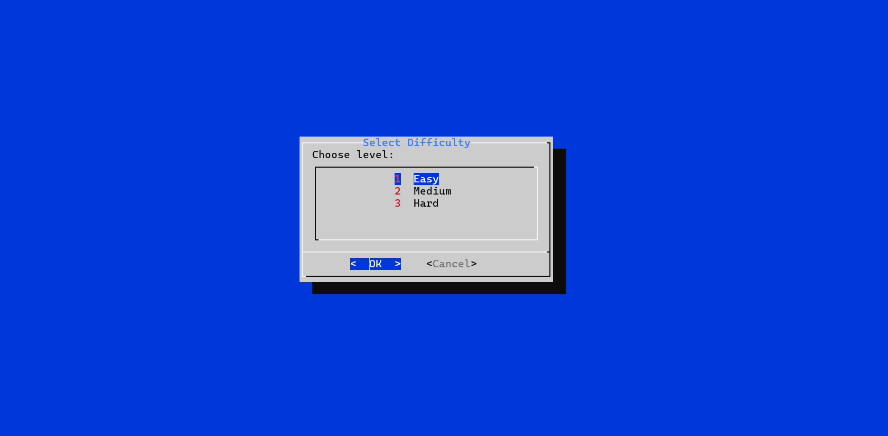
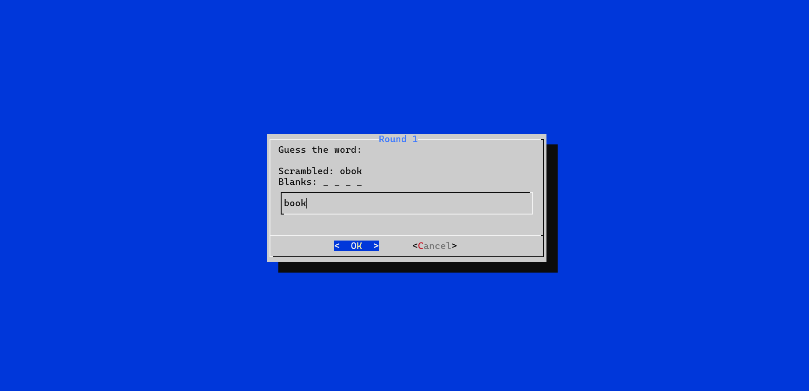
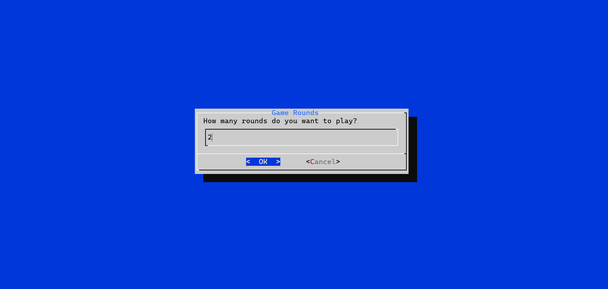
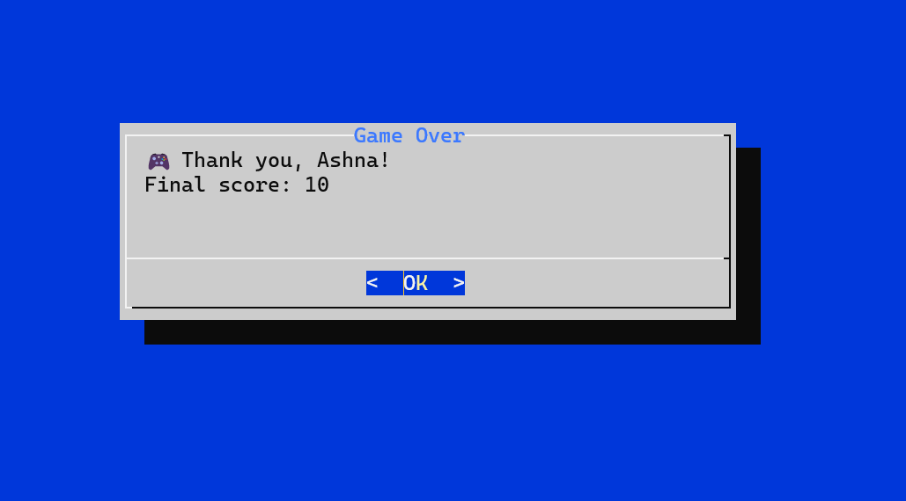
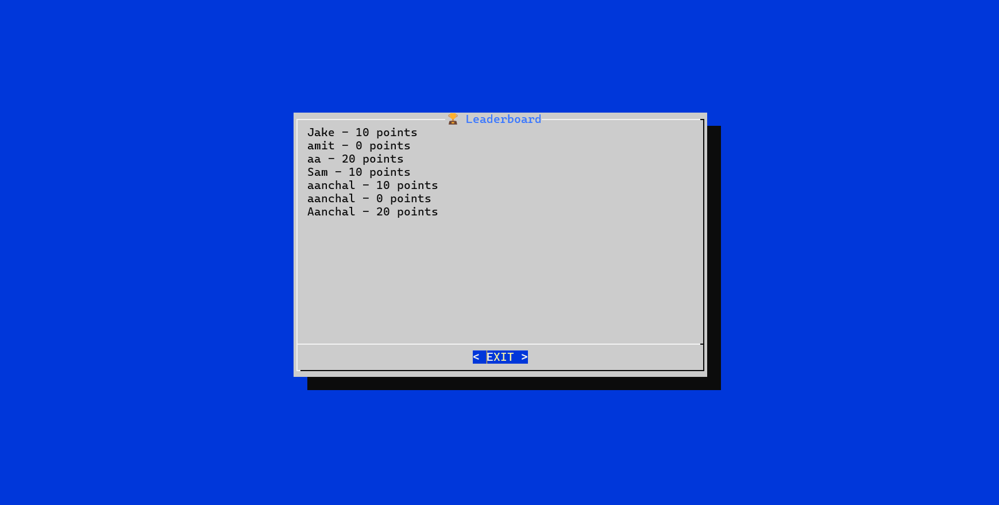

# 🎮 Bash Word Game

A terminal-based word guessing game implemented in Bash, designed for Linux and macOS systems.  
The game features difficulty levels, scoring, leaderboards, and a built-in dataset — no external word lists required!

---

## 🛠️ Requirements

To ensure compatibility and ease of execution, the following software components are required:

- **🖥️ Operating System:** Any Linux distribution (e.g., Ubuntu, Fedora) or macOS with terminal access.
- **🐚 Shell Environment:** Bash shell, version 4.0 or higher (for advanced array handling and scripting syntax).
- **📦 Dialog Utility:** The [`dialog`](https://invisible-island.net/dialog/) package must be installed to render interactive text-based UI components.  
  It is typically available in default repositories:
  ```bash
  # Debian/Ubuntu
  sudo apt-get install dialog

  # Fedora
  sudo dnf install dialog

  # macOS (with Homebrew)
  brew install dialog
  ```
- **📝 Text Editor:** Any basic or advanced text editor such as Vim, Nano, or Visual Studio Code to edit or review the script.

**✨ Optional Tools (for development):**
- [`shellcheck`](https://www.shellcheck.net/) – shell script linter.
- [Git](https://git-scm.com/) – version control.

---

## 📚 Built-in Dataset

The game uses a built-in dataset embedded directly into the script via Bash arrays (no external files needed).  
Words are grouped by difficulty:

- **🟢 Easy (3–5 letters):**  
  Suitable for beginners.  
  Examples: `bash`, `pen`, `mango`, `apple`

- **🟡 Medium (6–7 letters):**  
  Moderate challenge.  
  Examples: `ubuntu`, `wallet`, `rocket`, `python`

- **🔴 Hard (8+ letters):**  
  Intended for advanced players.  
  Examples: `terminal`, `firewall`, `pineapple`, `container`

---

## 📂 File Structure

- `game.sh`  
  🕹️ Main Bash script containing all game logic: welcome screen, gameplay loop, scoring, leaderboard display.

- `leaderboard.txt`  
  🏆 Persistent text file used to store player names and their scores, maintaining a history of high scores across sessions.

- `/tmp/tempfile`  
  🗃️ Temporary file created dynamically during gameplay to capture and store user inputs such as name, difficulty choice, and word guesses.  
  This file is deleted automatically at the end of the session.

---

## ▶️ How to Play

1. **Run the Game Script**  
   Make sure you have Bash 4+ and `dialog` installed, then run:
   ```bash
   bash game.sh
   ```
2. **Follow On-Screen Prompts**  
   - Enter your name.
   - Select a difficulty level.
   - Guess words to earn points.
   - View your score and the leaderboard at the end.

---

## 🖼️ Screenshots

Below are screenshots of the Bash Word Game in action:

### Welcome Screen


### Enter Username


### Game Rules


### Choose Levels


### Gameplay


### Rounds


### Scoreboard


### Leaderboard


---

## 💡 Notes

- No installation needed — just ensure dependencies are present and execute the script.
- The leaderboard persists between sessions; scores are stored in `leaderboard.txt`.
- The `/tmp/tempfile` is automatically cleaned up after each game session.

---

## 🤝 Contributing

Pull requests and suggestions are welcome!  
For code improvements, use optional tools like shellcheck and Git for best practices.
